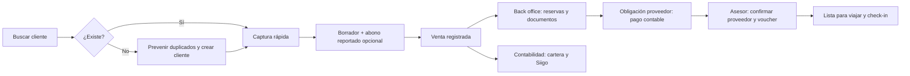

# Arquitectura y decisiones del MVP

## Objetivo y flujo

El expediente `Sale` reúne al cliente maestro, pasajeros independientes, servicios, cobros, obligaciones, documentos, tareas y eventos. Una venta nace `BORRADOR`; su creación exige cliente, asesor, **OS real de cuatro dígitos y al menos un servicio incluido**, incluso si todavía faltan datos para registrarla comercialmente. Registrar la venta exige precio y fechas aplicables. Un abono reportado no reduce el saldo contable hasta que contabilidad lo valide.

## Decisiones de negocio

- Siigo emite las facturas. El expediente conservará referencia, número y snapshot al momento de emisión; la integración API se añade cuando haya acceso a Siigo.
- Todos los cobros a clientes y pagos a proveedores son en **COP**. Una cotización extranjera, si existe, es informativa: el valor exigible es el COP acordado.
- La gerente puede actuar como asesora con idéntico flujo. `ADMINISTRADOR` es un superusuario de soporte con acceso a las funciones operativas existentes incluso sobre ventas ajenas; su autoría y el asesor responsable se registran por separado cuando crea ventas para otra persona.
- Cliente y pasajero son distintos; documentos emitidos conservan snapshot histórico.
- El saldo contable = total de venta menos pagos `VALIDADO` no anulados. El saldo proyectado también descuenta `REPORTADO`, claramente identificado. Las correcciones de importe conservan el valor anterior y el nuevo en `PaymentAmountCorrection`, salvo en un borrado definitivo de superusuario, que también elimina ese historial.
- Cada abono validado nuevo referencia un **recibo de caja (RC) único**, emitido en el sistema contable. El RC no se genera en esta aplicación: contabilidad lo indica y confirma viendo importe y número antes de validar. Todo se persiste en una transacción y el saldo solo cambia tras ella. Pagos históricos sin RC permanecen identificados para conciliación, sin números inventados.
- El asesor escribe la OS real como cuatro dígitos, por ejemplo `0123`; la interfaz muestra `OS 0123`. La unicidad es global, sin reinicio anual. Contabilidad y el superusuario pueden corregirla con motivo, confirmación y auditoría. La OS anterior puede utilizarse en otra venta cuando ya no esté asignada. Los códigos VEN históricos se preservan hasta obtener su OS verdadera.
- Una OS nueva selecciona uno o varios servicios de Vuelos, Hotel, Traslados, Asistencia médica, Tours u Otro. Cada selección crea un `Service` POR_RESERVAR sin costos o proveedores asumidos; `Sale.serviceType` queda reservado como categoría histórica opcional. `Sale.notes` contiene las observaciones generales y es obligatorio en creación si se elige Otro. No se inventa el desglose de órdenes históricas con categoría PAQUETE. La corrección de servicios en un borrador no puede retirar servicios que ya tengan información operativa o compromisos.
- Cada OS puede tener muchos localizadores independientes (`SaleLocator`), clasificados por origen/emisor, con vínculo opcional a `Service`. Su código conserva la escritura original y admite duplicados en otros emisores. El autor puede corregir los que registró si aún tiene acceso a la OS; back office y el superusuario pueden corregir cualquiera, con valor previo y nuevo auditados. El asesor añade en sus ventas; los demás roles operativos añaden en las OS a las que pueden acceder.
- Contabilidad corrige el importe de un abono `REPORTADO` o `VALIDADO` mediante un flujo con motivo y confirmación. Si ya hay recibo, su valor se corrige en la misma transacción y su número permanece; `PaymentAmountCorrection` conserva importes previos y nuevos. El saldo se recalcula desde los pagos validados. No se captura «Referencia» en pagos nuevos; el dato de pagos históricos se conserva.
- El superusuario puede borrar físicamente, bajo confirmación escrita, un abono junto con su recibo, una OS con sus datos dependientes o un cliente con sus ventas. No se exige resolver pagos antes de este borrado del superusuario; la acción borra también las entradas de auditoría relacionadas y no crea otra. Las restricciones de unicidad dejan libres los números eliminados. Las demás funciones financieras conservan sus reglas normales.
- Una obligación proveedor solo nace con proveedor, costo COP y fecha de pago definidos. Una reserva aún sin esos datos continúa pendiente de completar.
- La lista de requisitos de la siguiente transición, no un porcentaje arbitrario, explica los bloqueos del expediente.

## Estados y transiciones

| Proceso | Estados | Transición controlada |
| --- | --- | --- |
| Comercial | BORRADOR, REGISTRADA, CONFIRMADA, CANCELADA | Registrar exige mínimos; cancelar exige motivo |
| Cartera (derivado) | SIN_PAGO, PENDIENTE_VALIDACION, PARCIAL, PAGADA, VENCIDA | Suma pagos validados; vencida si saldo y plazo superado |
| Reserva | POR_RESERVAR, SOLICITADA, PENDIENTE_CONFIRMACION, CONFIRMADA, CANCELADA | Confirmación exige proveedor y localizador |
| Operación (derivado) | PENDIENTE, EN_GESTION, PARCIAL, COMPLETA, DOCUMENTACION_PENDIENTE, LISTA, EN_VIAJE, FINALIZADA | Pasajeros, servicios, vouchers, check-in y política de cobro |
| Proveedor | PENDIENTE, PROGRAMADO, PAGO_SOLICITADO, EN_PROCESO, PAGADO, PENDIENTE_CONFIRMACION, CONFIRMADO, VOUCHER_RECIBIDO, ANULADO | Contabilidad paga; asesor confirma y recibe voucher |
| Pago cliente | REPORTADO, VALIDADO, RECHAZADO, ANULADO | Solo contabilidad valida; anulaciones con motivo |
| Factura | PENDIENTE, FACTURADA, ANULADA | Referencia Siigo y snapshot inmutable |
| Tarea | PENDIENTE, EN_PROCESO, COMPLETADA, CANCELADA | Vencida es condición derivada |

## Permisos y alcance de registro

| Acción | ASESOR | BACK_OFFICE | CONTABILIDAD | GERENTE | ADMINISTRADOR |
| --- | --- | --- | --- | --- | --- |
| Buscar cliente y crear ficha | Sí | Ver asignadas | Ver para cartera | Sí | Todas |
| Crear y editar venta | Propias | No | No | Como asesor | Todas; asignar responsable explícito |
| Reportar abono | Propias | No | Sí | Como asesor | Sí |
| Validar pago | No | No | Sí | Supervisar | Sí |
| Reservar / check-in | Consultar | Asignadas | No | Supervisar | Todas las funciones disponibles |
| Pagar proveedor | Seguimiento | No | Sí | Autorizar excepción | Todas las funciones disponibles |
| Confirmar proveedor / voucher | Propias | Apoyo operativo | No | Como asesor | Todas las funciones disponibles |
| Factura y recibo | Consulta | No | Sí | Supervisar | Todas las funciones disponibles |
| Auditoría global | No | No | Finanzas | Sí | Toda la información aún existente |
| Configuración técnica | No | No | No | Política autorizada | Sí |

Los permisos se comprueban en el servidor y también contra la asignación de la venta, salvo en el acceso explícito del superusuario a expedientes ajenos. La matriz incluye capacidades futuras; el estado de las funciones ya operativas está en [funcionalidades implementadas](incremento-01.md).

`ADMINISTRADOR` puede asignar y retirar roles propios y ajenos con motivo y auditoría, ver clientes y ventas de cualquier asesor y ejecutar acciones comerciales y contables existentes. Al menos un administrador activo debe conservar ese rol. Se usan versiones y transacciones serializables para evitar sobrescrituras y retirar accidentalmente los dos últimos administradores en paralelo. Solo el rol ADMINISTRADOR accede a los endpoints de borrado definitivo.

## Automatizaciones y excepciones

- Abono reportado → tarea de contabilidad «Validar pago recibido».
- Venta registrada → tarea back office «Iniciar gestión».
- Servicio pagadero completo → obligación proveedor con vencimiento.
- Proveedor pagado → tarea asesor «Confirmar recepción»; recepción confirmada → «Obtener voucher».
- Vuelo → tarea check-in según apertura configurada (24 h por defecto).
- Alertas: cartera 7/3/0/+1 días; proveedor 7/3/1/0 y vencido; viaje sin voucher, factura pendiente, pago sin validar, check-in vencido, datos críticos pendientes.
- Tareas representan acciones; alertas representan condiciones y se deduplican mediante clave estable. Vencidos se escalan a gerencia.

## Validaciones y duplicados

Documento normalizado + tipo + país único en base de datos y coincidencia exacta bloqueante en UI. Teléfono/correo coincidentes generan candidatos de advertencia. Fecha de regreso **posterior** a salida; precio y abono positivos; abono <= saldo considerando también reportes pendientes; correo válido; moneda COP; validación distinta por etapa. Ediciones usan `version` para detectar conflictos. La API valida de nuevo cada regla. Claves de idempotencia previenen doble creación.

Al validar un abono, la API exige número de recibo no vacío **formado solo por dígitos**, preserva ceros iniciales, confirma la versión del importe mostrado y crea `Receipt` vinculado uno a uno con `CustomerPayment`. Índices únicos impiden utilizar el mismo número o vincular dos recibos al mismo abono. Rechazar el abono exige motivo y no crea recibo. La OS se valida en backend y en la base de datos; contabilidad y el superusuario pueden cambiarla. Las correcciones de importe deben mantenerse dentro del total de la venta, considerando todos los pagos reportados y validados.

El borrado definitivo comprueba rol explícito, identificador escrito exactamente igual al actual y una huella de los registros que se van a eliminar. Dentro de una transacción serializable elimina los hijos antes que el expediente, incluidos recibos validados, correcciones, facturas, reservas, obligaciones, tareas, documentos y auditorías relacionadas. La huella se vuelve a calcular antes de ejecutar: si cambian importes o registros, exige revisar nuevamente el impacto. Los catálogos compartidos, como proveedores o pasajeros vinculados a otras ventas, permanecen.

## UX y navegación

Captura rápida: cliente existente o nuevo → OS real → destino → selección múltiple de servicios → observaciones de la OS → fechas → total COP → abono opcional → Crear venta. Asesor y fecha se infieren de sesión. Salida y regreso pueden teclearse en `DD/MM/AAAA` o elegirse en el calendario; al elegir salida con el calendario se abre regreso limitado a días posteriores. Expediente: resumen con requisitos faltantes, servicios, localizadores de distintos emisores, observaciones, cartera, tareas y actividad. Contabilidad ve acciones para corregir OS e importes con una vista previa antes de confirmar. `Tab` sigue orden visual; autocompletado usa ↑/↓/Enter/Escape; `Ctrl+K` búsqueda, `Ctrl+N` nueva venta, `Ctrl+S` borrador y `Ctrl+Enter` acción primaria. Dashboards por rol muestran primero tareas y excepciones. El diseño Corporate Trust aplica a toda la aplicación; efectos decorativos no interfieren en formularios ni datos financieros.

## Técnica y riesgos

Next.js + TypeScript, módulos de dominio en `src/lib`, Prisma + PostgreSQL, sesiones almacenadas por hash, cookies HttpOnly, RBAC servidor, transacciones, auditoría y outbox. Archivos futuros en almacenamiento S3 compatible con metadatos en PostgreSQL. UTC para instantes y zona IANA de vuelos; Colombia es la zona de presentación inicial. Riesgos: duplicidad por concurrencia, pagos sin validar en saldo, permisos por expediente, eventos duplicados, snapshot fiscal y cambios de precio: se protegen mediante restricciones, estados distintos, idempotencia, auditoría y transiciones.

## Pantallas e incrementos

Ingreso; Inicio contextual; Clientes (búsqueda, alta, ficha/historial); Ventas (captura rápida, expediente, lista); Contabilidad (cartera, Siigo, egresos); Proveedores; Operación (reservas, documentos, check-in); Tareas/alertas; Gerencia; Auditoría; Administración. Se implementan por incrementos completos; las rutas aún no desarrolladas no se presentan como operativas. La estructura es `src/app` (pantallas/API), `src/lib` (dominio/acceso), `prisma` (modelo/migraciones/seed), `tests` y `docs`.
